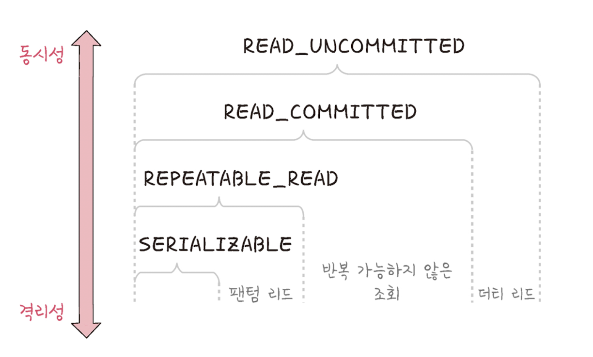
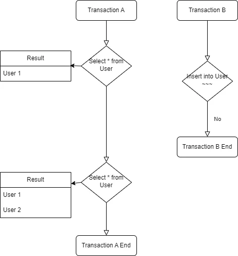

# 트랜잭션

트랜잭션은 DB에서 하나의 논리적 기능을 수행하기 위한 작업의 단위

DB에 접근할 때는 쿼리를 사용하기에 여러개의 쿼리를 묶는 단위를 말하기도 한다.

이에 대한 특징은 원자성(Atomicity), 일관성, 독립성, 지속성 4개이며 이 4가지 특성을 ACID라고 부른다.

## 원자성

원자성은 트랜잭션과 관련된 일이 모두 수행되었거나, 안되었거나를 보장하는 특징. 즉 트랜잭션 안의 모든 쿼리가 하나의 작업 단위임을 보장하는 것.

원자성의 중요성에 대한 설명은 주로 돈 거래를 예시로 많이 들어 설명한다.
예를 들어 10,000원을 가진 A가 B에게 5,000원을 보내는 과정을 쿼리로 풀어보자면

1. A의 잔고 조회
2. A에게 5,000원 제거
3. B에게 5,000원 전송

이 작업 중 에러 발생으로 인해 작업을 취소해야할 때 1,2,3 모든 과정을 한번에 취소해야한다.

물론 2,3번까지만 취소되는 것은 문제되지 않지만 그래도 일부가 초기화가 되지 않게 된다면 A나 B의 잔고 상태가 문제가 생기게 된다.

정상적으로 transaction이 실패하게 되면 B의 경우는 문제가 생기면 5,000원을 얻고, A의 경우는 5,000원을 잃는다. B는 여기서 이득을 볼 수 있지만, 은행사가 그 돈을 지불해야하는 상황이니 어찌됬든 누군가는 손해를 보게 되니... transaction은 최대한 하나의 작업 단위를 취소한다면 모든 것을 취소해야한다.

특히 서비스 단위에서 하나의 트랜잭션 안에서 외부 API를 호출하는 트랜잭션을 만들면 안된다.

외부 API 호출하는 시점에서 그 API는 하나의 트랜잭션이 아닌 2개 이상의 트랜잭션이 되고 롤백 시 정상적으로 되지 않을 것이다.

차라리 외부 API 호출이 아닌 외부 모듈을 통해 DB를 호출하는 코드를 가져오는게 낫지 않나 싶다. (MSA)

### 트랜잭션 전파

트랜잭션을 수행할 때 커넥션 단위로 수행하기 때문에 커넥션 객체를 넘겨서 수행해야한다.
매번 Connection에 넘겨주는 것이 귀찮고 어려우니 넘겨서 수행하는 것이 아닌 여러 트랜잭션 관련된 코드들을 하나의 메소드에 묶어 하나의 트랜잭션에 묶이도록 하는 것을 트랜잭션 전파라고 한다

Spring에서는 @Transaction 어노테이션을 사용해 여러 쿼리 관련 코드들을 하나의 트랜잭션으로 묶어서 사용한다.

## 일관성

일관성은 항상 허용된 방식으로만 데이터를 변경해야 함을 의미한다. DB의 데이터 처리에 대해서는 항상 일관된 방식으로 처리해야함.

ex. A가 10,000원, B가 5,000원이 존재할 때 B가 10,000을 송금하는 것은 불가능하다.
ex. A가 10,000원, B가 5,000원이 존재할 때 A가 5,000을 송금하는 것은 가능하다.

## 격리성

트랜잭션은 수행 시 서로 간섭하지 못하는 것을 의미한다.

복수의 병렬로 진행되는 트랜잭션은 서로 격리되어 순차적으로 실행되는 것 처럼 작동되어야 하고, DB는 여러 사용자가 같은 데이터에 접근할 수 있어야 함.

순차적으로도 진행은 가능하나, 직렬로 처리하게 되면 DB 처리 속도가 느려진다.(작업이 밀리니까) 성능에는 문제가 생길 수 있으니 여러 격리 수준에 따라 처리하는 방법을 나눠 다양하게 처리하고 있다.

격리성은 여러 개의 격리 수준으로 나뉘어 격리성을 보장한다.

단계는 위의 이미지 처럼 몇개로 나뉘어 있는데, 각각

- SERIALIZABLE
- REPEATABLE_READ
- READ_COMMITTED
- READ_UNCOMMITTED

4개의 단계로 이루어져 있으며, 위 그림 처럼 위로 올라가는 단계일 수록 동시성은 올라가나 격리성은 떨어지고, 밑으로 갈수록 격리성은 오르지만 동시성은 떨어진다.

(격리성은 오르지만 동시성이 떨어지는 것은 순차적으로 처리한다는 의미기에 처리 속도가 느려진다를 의미한다.)

또한 각 단계마다 나타나는 현상이 있는데,

REPEATABLE_READ => 팬텀 리드

READ_COMMITTED => 팬텀 리드, 반복 가능하지 않은 조회

READ_UNCOMMITTED => 팬텀 리드, 반복 가능하지 않은 조회, 더티 리드

식으로 발생할 수 있다.

### 격리 수준에 따라 발생하는 현상

위에 격리성을 낮출 때 마다 발생하는 현상들이 있는데 이 현상들이 어떤 것인지에 대해 알아보자

#### 팬텀 리드

**한 트랜잭션 내**에서 첫번째 쿼리와 두번째 쿼리가 다른 결과 값을 가져올 수 있음을 말함.
외부에 동시에 실행중인 트랜잭션의 Insert 작업에서 발생할 수 있는 현상

쉽게 설명하면 Transaction A 에서 select \* from user; 에 1개의 테이블만 조회되었는데, Transaction B에서 중간에 user table 에 값을 추가한 후 Transaction A에서 다시 select \* from user;를 호출하게 되면 2개의 테이블이 조회되는 문제

즉 하나의 트랜잭션에서 여러개의 select의 결과 범위가 외부 트랜잭션에 영향을 미칠 수 있음을 의미한다.

#### 반복 가능하지 않은 조회

**한 트랜잭션 내**의 같은 행에 두 번 이상 조회가 발생했는데 그 값이 다른 경우를 나타냄

팬텀 리드의 경우는 insert에 관련된 얘기다. 외부에서 insert문이 발생해 데이터가 추가될 수도 있다라는 내용이였다면, 반복 가능하지 않은 조회의 경우는 같은 쿼리를 돌려도 값이 다르게 나올 수 있음을 의미한다.

다른 트랜잭션에서 값을 업데이트 하게 된다면, 업데이트 한 값을 재조회하면서 문제가 생길 수 도 있다라는 것이다.

#### 더티 리드

반복 가능하지 않은 조회와 유사하며, 하나의 트랜잭션이 실행 중일 때 다른 트랜잭션에 의해 수정되었으나 아직 커밋되지 않은 행의 데이터를 읽을 수 있을 때 발생함.

- 커밋: 트랜잭션이 완료된 이후 트랜잭션 단위의 쿼리 처리를 DB에 영구 저장하는 작업

즉 커밋이 완료되지 않아 DB 정보가 최종 승인이 나지 않은 상태임에도 그것이 다른 트랜잭션에 반영될 수 있다라는 것이다.
롤백 상황에 대한 대응이 되지 않은 채 작업이 진행되어 DB가 롤백되지 않은 새로운 값이 들어갈 수 있는 현상

### 격리 수준의 종류와 역할

위의 격리 수준에 따라 발생하는 이슈들이 많고, 이 이슈들이 전부 일어나지 않으면 좋지만 격리성이 높을 수록 동시성이 낮아 속도가 매우 느려서 회사의 상황에 따라 적절하게 사용해 성능과 격리성을 조절해 챙기게 된다.

그 격리 수준의 종류와 역할에 대해 각각 적어본다.

#### SERIALIZABLE

트랜잭션을 순차적으로 진행시키는 것을 말한다. 여러 트랜잭션이 동시에 같은 행에 접근할 수는 없고, 엄격한 수준으로 해당 행에 격리시키고 트랜잭션이 특정 행에 일어나면 다음 트랜잭션이 특정 행에 작업을 하려면 기다려야한다.

그러다보니 처리 중에 기다려야하는 경우도 생겨 속도가 떨어질 수 있다.

#### REPEATABLE_READ

하나의 트랜잭션이 수정한 행을 다른 트랜잭션이 수정할 수 없도록 막아주나, 새로운 행을 추가하는 것에 대해서는 막지 않는다.

팬텀 리드가 발생할 수 있고 MySQL 8.0의 innoDB 기본 값이기도 하다.

#### READ_COMMITTED

가장 많이 사용되는 격리 수준이며, PostgreSQL, SQL Server, 오라클에서 기본값으로 설정되어 있다.

READ_UNCOMMITTED와는 다르게 다른 트랜잭션이 커밋하지 않은 정보는 읽을 수 없다. 즉 커밋 완료된 데이터에 대해서만 조회를 허용한다.

하지만 어떤 트랜잭션이 접근한 행을 다른 트랜잭션이 수정이 가능하다.

#### READ_UNCOMMITTED

가장 낮은 격리 수준으로, 하나의 트랜잭션이 커밋되기 이전에 다른 트랜잭션에 노출되는 문제가 있으나 가장 빠르다.(동시성이 가장 좋다)

데이터 무결성을 위해 되도록이면 사용하지 않는 것이 이상적이지만 몇몇 행이 제대로 조회되지 않더라도 괜찮은 거대한 양의 데이터를 어림잡아 집계하는 데는 사용하면 좋음.

즉 성능을 위해 데이터 무결성을 포기하는 곳에서 주로 사용하기 좋음

## 지속성

지속성은 성공적으로 수행된 트랜잭션은 영원히 반영되어야 하는 것을 의미함

이는 DB에 시스템 장애가 발생해도 원래 상태로 복구하는 회복 기능이 있어야 함을 뜻하고, DB는 이를 위해 체크섬, 저널링, 롤백 등의 기능을 제공한다.

- 체크섬: 중복 검사의 한 형태로 오류 정정을 통해 송신된 자료의 무결성을 보호하는 단순한 방법

- 저널링: 파일 시스템 또는 DB 시스템에 변경 사항을 반영(commit) 하기 전 로깅하는 것, 트랜잭션 등 변경 사항에 대한 로그를 남기는 것

### 무결성

위에서 무결성에 대한 얘기가 많이 나온다.
무결성은 데이터의 정확성, 일관성, 유효성을 유지하는 것을 말하며 무결성이 유지되어야 DB의 저장된 데이터 값과 그 값에 해당하는 현실 세계의 실제 값이 일치하는지에 대한 신뢰가 생긴다.

#### 무결성의 종류

- 개체 무결성: 기본키(Primary Key)로 선택된 필드는 빈 값을 허용하지 않는다.
- 참조 무결성: 서로 참조 관계에 있는 두 테이블의 데이터는 항상 일관된 값을 유지해야 한다.
- 고유 무결성: 특정 속성에 대해 고유한 값을 가지도록 조건이 주어진 경우 그 속성 값은 모두 고유한 값을 가진다.(Identify)
- NULL 무결성: 특정 속성 값에 NULL이 올 수 없다는 조건이 주어진 경우 그 속성 값은 NULL이 될 수 없다는 제약 조건
