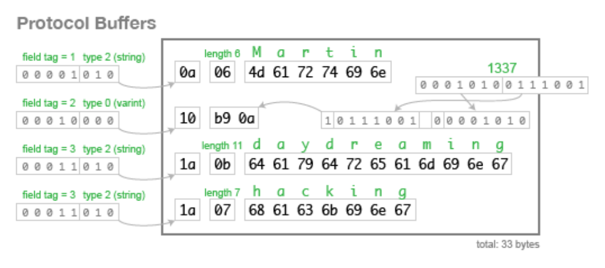

# gRPC

최근 큰 회사들은 https 통신이 아닌 gRPC 통신을 사용해 MSA를 더 완벽하게 구성한다고 하는데 관련되어서 무슨 말인지 자세하게 알아보자

## gRPC란?

gRPC에서 클라이언트가 로컬 서비스인 것 처럼 다른 시스템에 있는 서버의 메소드를 직접 호출할 수 있는 분산 애플리케이션과 서비스를 더 쉽게 만들 수 있는 프로토콜이다.

gRPC는 google Remote Procedure Call이라는 뜻으로 구글에서 만든 RPC(Remote Procedure Call)을 말하는 것 이다.

gRPC또한 많은 RPC 시스템과 마찬가지로 gRPC는 서비스 정의, 매개 변수 및 반환 유형을 사용해 원격으로 호출할 수 있는 메서드를 지정한다는 아이디어를 기반으로 하고, 서버 측에서는 인터페이스를 구현하고 gRPC 서버를 실행해 클라이언트 호출을 처리하게 된다.

### RPC란?

RPC는 원격 프로시저 호출이라는 뜻으로 REST와 비슷한 API 설계의 아키텍쳐 중 하나이다.

API라는 것 자체는 두 개 이상의 소프트웨어 구성 요소가 서로 통신할 수 있게 하는 매커니즘이고, RPC API를 사용하게 된다면 개발자가 외부 서버의 원격 함수를 마치 로컬 환경의 함수처럼 직접 호출이 가능하다는 장점이 있다.

https 통신을 사용할 경우 JS를 예시로 들면 RestAPI의 path를 손수 입력하고 이것은 외부 API 통신이라고 인지하는 것 처럼 코드를 작성해야 했다만, RPC는 그렇게 되지 않고 로컬 함수처럼 사용한다는 것 이다.

무엇보다도 gRPC를 사용하면 언어 제한이 없이 gRPC를 사용하는 곳 끼리는 모든 함수들이 공유 가능하다라는 이점도 있다. Go, Python or Ruby 클라이언트를 이용해 Java로 gRPC서버를 쉽게 만드는 것도 가능하다라는 것이다.

- 참고: Proto2는 C++, Java, Python, Go 4개만 지원하나, Proto3부터 C++, Java, Python, Go, Ruby, Objective-C, C#, Javascript, PHP, Dart를 지원 즉 6개의 언어를 추가로 지원해 JS 환경이라면 Proto3부터 써야할 것 이다.

```
// test-api.js
// RestAPI의 경우
const res = await fetch('https://test-api.link.com/mock');

// RPC의 경우 (예시이고 실제로 이런 방식은 아닐 수 있음)
const res = getMockDataInTestApi();
```

#### 아키텍쳐 원칙

REST랑은 다르게 RPC 프로토콜을 사용해 API를 작성하게 되면 다음과 같은 원칙에 따라 개발한다. 다만 REST처럼 표준화된 규칙은 아니다.

1. 원격 간접 호출
   클라이언트는 원격 서버 함수에 대해 RPC를 직접 호출하지만 클라이언트에 로컬로 호출된 것 처럼 호출한다.

2. 파라미터 전달
   클라이언트 내부에서 사용하는 함수처럼 서버에도 파라미터를 호출하는데, 이것도 역시 로컬에서 호출하는 것 처러 호출한다.

3. 스텁
   함수 스텁(속이 빈 함수)은 클라이언트와 서버 모두에 존재하는데 클라이언트에서는 함수를 직접 호출하고 서버는 실제 함수를 간접적으로 호출한다.

### 프로토콜 버퍼 작업

gRPC는 기본적으로 프로토콜 버퍼를 사용한다. 프로토콜 버퍼란 구조화된 데이터를 직렬하기 위한 Google의 오픈 소스 매커니즘으로 json과는 다르게 데이터 구조를 정의하는 특징을 가지고 있다.

```
// JSON
{
    "userName": "Sangmin",
    "age": 27,
    "interests": ["game", "code-ing"]
}

// Protocol Buffer
message Person {
  string user_name = 1;
  int32 age = 2;
  repeated string interests = 3;
}
```

JSON의 경우 데이터에 대해 모든 정보를 저장하는 방식으로 직렬화 할 때 까다로운 부분도 어느정도 있다.

하지만 protocol buffer는 `.proto`라는 확장자 파일을 만들어 그 안에 필드에 대한 간단한 접근자와 전체 구조를 직렬화하고 구문 분석까지 진행 가능하도록 만들어주는 데이터 모델을 정의해주는 것이 특징이다.

#### 프로토콜 버퍼 해석 방법


출처 : `https://martin.kleppmann.com/2012/12/05/schema-evolution-in-avro-protocol-buffers-thrift.html`

위의 그림을 보면 protocol buffer를 해석할 때 데이터 바이트 단위로 해석하는 것을 볼 수 있다.

- field tag: message 객체 내부에서 각 변수 명에 대한 field tag를 정의하고 데이터 타입(string or int32 등)과 합쳐 메모리 위치 값 자체를 적어준다. 가장 큰 특징은 총 8개의 비트 연산자에서 앞의 5자리는 field tag가 뒤에 3자리는 변수의 타입이 차지해 총 8자리를 조합해 초반 변수의 2개 자릿수를 계산하고 참조할 수 있도록 처리하는 것이 핵심이다

- length: 2번째 byte 값을 보면 문자열이 몇개인지를 정해주는 byte값이 들어간다. 숫자인 경우에는 굳이 필요없이 바로 value가 들어가지만 string 기준으론 추가로 얼마만큼 뒤에 메모리를 할당할 건지를 표시한다는 특징이 있어 메모리를 미리 할당해야하는 정적 언어(C++)등에는 매우 매우 편하게 쓸 수 있는 값 처럼 보인다. (개인 의견 포함)

- value: 마지막에는 value가 들어가게 된다. 문자열을 byte화 시켜 2자리 16진수로 각 문자열을 적어 byte안에 넣음으로써 최소화 된 압축 객체를 만들 수 있다.

이미지의 예시는 총 33byte가 들게 되고, 위의 Json과 buffer를 각각 비교하게 된다면 다음과 같이 될 수 있다.

##### 결과값

- json의 경우: 글자의 총 갯수를 구하면 된다. 중괄호 2개, 쌍따옴표가 12개, 순수 문자열이 userName(8), Sangmin(7), age(3), interests(9), game(4), code-ing(8), 대괄호 2개, 쉼표 3개, : 3개까지 해서 총 61 바이트를 활용해 데이터 객체 하나를 표시하고 있다.

- protocol buffer의 경우: 데이터 직렬화한 기준으로 하나의 데이터를 비교해보면, 고유한 필드 태그(변수 값)과 type까지 해서 1개의 byte, 변수는 총 3개지만 interests가 2개 사용되니 총 `4 bytes`로 변수를 선언하고 문자열의 경우 길이를 정해주고 숫자는 값 그대로 넣으면 된다. 27은 작은 수라 `1 byte`로 끝나고, 문자열 길이 또한 32보다 작아 1 byte내로 끝나기 때문에 총 `3 bytes`를 활용, 문자는 알파벳 하나당 1개의 byte를 활용하니 위의 문자 총 숫자 갯수 7 + 4 + 8인 `19 bytes` 까지 해서 총 27 bytes로 하나의 객체를 표시하게 된다.

즉 json에서 오차가 조금 있었다고 한들 61 bytes > 27 bytes 에는 극심한 차이로 값이 정의되기에 메모리 관리 차원에서 정말 이득이라고도 볼 수 있다.

#### 장점

이 buffer 작업을 통해서 얻을 수 있는 장점은 몇가지 존재한다.

1. 통신이 빠르게 될 수 있다.
   애초부터 전달해야한 메모리의 양이 적어 더 적은 시간을 들여 같은 정보를 빠르게 전달할 수 있다.

2. 별도의 parsing 작업이 필요하지 않다.
   JSON의 경우 들어온 객체에 대해 parsing 작업을 진행해 특정 Object에 맞춰줘야하는 작업을 추가로 진행 해야하는 불편함이 존재하지만, 프로토콜 버퍼는 메모리 그대로 가져다 사용하면 되서 별도의 parsing 작업이 필요하지 않아 추가 작업이 없다는 장점 또한 있다.

#### 단점

1. 인간이 데이터를 읽기는 불편하다.
   JSON의 경우 key, value에 대해 각각 어떤게 들어갈 지 대략 예상도 가고 읽기 편하지만 protocol buffer는 사람이 읽으려면 선행 지식을 필요로 하게 된다.

   그리고 `.proto` 타입의 파일이 있어야만 그 객체의 정보를 읽을 수 있다.

2. proto 문법을 배워야 한다.
   스키마 작성을 위해 proto 문법을 따로 익히고 써야한다.

   json은 간단하게 key, value만 넣으면 됬었지만 proto 문법은 그와 다르다라는 것을 알 수 있다.

3. 위험하다 (개인 견해)
   문서를 덜 읽어봤지만 proto에 의존한다라는 말은 즉 `.proto` 파일이 손상된다면 관련된 데이터들도 모두 손상되어 제대로 읽는 것이 불가능하다라는 말 또한 된다.

   JSON의 경우 key, value로만 이어져 있어 하나의 데이터가 손상되는 경우 그냥 에러로 끝나 그 데이터를 제거하거나 수정하면 끝나는 문제이나, `.proto` 파일이 손상되면 수많은 파일들을 제대로 읽을 수 없어져 각 타입들의 재정의와 변수 할당을 새로 해야한다는 문제가 생기게 된다.

   물론 이 문제는 보안 측면에서 잘 지키고 백업만 잘하면 되는 문제고 JSON도 손상되면 못쓰는 것은 동일하다. 다만 손상에 대한 크리티컬 정도는 매우 다르지 않을까라고 예상 된다.

### HTTP/2 only

이전까지의 RPC들은 메세지 (Json 등)을 Serialize할 수 있는 프레임워크인 PB(Protocol Buffer)만을 제공해왔다면 gRPC는 PB 기반 Serializer에 HTTP/2를 결합해 새로운 프레임워크를 탄생시키게 되었다.

HTTP/1은 기본적으로 클라이언트 요청이 올 때만 서버가 응답하는 구조고 매 요청마다 connection을 생성해야 하는 문제가 있다. 이 문제는 추후 Keep-alive라는 옵션이 나오면서 조금 보완되지만 그럼에도 무거운 header를 요청 시 전달해야하는 문제는 남아있다.

HTTP/2에서는 하나의 connection으로 동시에 여러 메시지를 주고받고 header를 압축해 바이너리 형태로 전달해주기에 훨씬 효율적이며, 필요 시 클라이언트 요청 없이도 서버가 리소스를 전달 가능하기에 클라이언트 요청을 최소화 할 수 있다.

### Stub Fuction

프로토콜 버퍼를 이용해서 서버와 클라이언트 간의 공유할 함수 인터페이스를 만들어준다. 메세지를 통해서 소통하는 HTTP/2 방식의 통신을 이용하기 위해 메세지 인터페이스를 정의하고 서로 request, reponse에 각각 반응을 미리 정의해두는 방식을 쓴다.

```
// 단방향 1:1 response
service SearchService {
   rpc Search (SearchRequest) returns (SearchResponse);
}

// 양방형 Streaming RPC
service SearchService {
   rpc Search (stream SearchRequest) returns (stream SearchResponse);
}
```

위와 같은 형태로 모든 곳에서 사용할 통신 규약을 `.proto`에 기록하고 다양한 언어 환경에서 사용함으로써 클라이언트와 서버 간에 함수 정의 및 호출을 동일한 이름을 사용해 호출한다.
