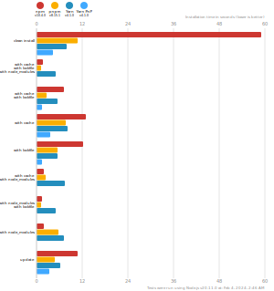

# 패키지 매니저

패키지 매니저란 프로젝트가 의존하고 있는 패키지를 효과적으로 설치, 관리, 갱신, 삭제 할 수 있도록 관리를 도와주는 시스템

JS의 패키지 매니저는 npm, yarn, yarn berry, pnpm 크게 4가지가 존재하는데 각각의 장단점에 대해 알아보자

## npm

노드 패키지 매니저라는 뜻으로 npm이라는 이름을 지었고 JS의 기본이자 가장 널리 사용되는 패키지 매니저이다.
FE,BE 개발에 모두 사용 가능한 200만 개 이상의 패키지가 포함된 거대한 저장소로 성장함

### 장점

- 보편적인 패키지 매니저 (에러 발생 시 추적이 편함)
- 종속성 취약 보완해주는 보안 감사 도구 내장

### 단점

- 속도가 느림
- 비 효율적 의존성 검색
  - 최상단 디렉토리 부터 계속해서 검색해 나가기 때문에 불필요한 것들도 검색해야했음
  - 잘못된 의존성을 가져오는 경우가 있음
  - 유령 의존성
    - 패키지 매니저들의 불필요한 의존성을 제거하기 위해 호이스팅을 이용해 패키지들을 전부 끌어올려 평탄화 시킴
    - 간접적으로 의존성이 있는 패키지도 끌어와 다운로드 됨으로 package.json에 없는 패키지도 사용이 가능해진다
  - 무거운 node_modules
    - 너무 무거워서 잘 다운받았는지만 확인하고 구성이 잘 되어 있는지 확인을 잘 안함

## yarn

npm이 너무 느리다는 것을 보완하기 위해 구글과 페이스북이 새로운 패키지 매니저를 만듬

### 장점

- 캐시 사용
  - 별도의 캐시 파일을 가지고 있어 이미 다운된 패키지를 가져다 쓸 수 있어 다운 속도를 줄일 수 있다.
- 자동화 된 lock 파일 생성
  - 지금은 npm도 package-lock.json을 생성해주지만 예전에는 자동으로 생성해주지 않았음
  - lock 파일의 필요성
    - 패키지 매니저는 ^나 ~를 사용해 버전의 범위를 지정하는 경우가 잦음
    - 버전의 범위를 지정해 가끔 재설치 시 기존에 사용하던 버전이 다운로드 되지 않는 경우가 있음
    - lock 파일은 사용되는 버전을 아에 잠금으로써 정확한 버전을 사용할 수 있게 해줌
- 병렬화를 통한 속도 개선
  - npm은 직렬화로 다운이 되고 있어 속도가 느렸음

### 단점

- 비 효율적 의존성 검색
  - 최상단 디렉토리 부터 계속해서 검색해 나가기 때문에 불필요한 것들도 검색해야했음
  - 잘못된 의존성을 가져오는 경우가 있음
  - 유령 의존성
    - 패키지 매니저들의 불필요한 의존성을 제거하기 위해 호이스팅을 이용해 패키지들을 전부 끌어올려 평탄화 시킴
    - 간접적으로 의존성이 있는 패키지도 끌어와 다운로드 됨으로 package.json에 없는 패키지도 사용이 가능해진다
  - 무거운 node_modules
    - 너무 무거워서 잘 다운받았는지만 확인하고 구성이 잘 되어 있는지 확인을 잘 안함

## pnpm

flat한 node_modules가 아닌 트리 형태로 구성함. 복잡한 구조로 속도가 느려지지 않을까 하지만 독자적인 알고리즘으로 해결

### 특징

- pnpm의 경우 의존성 패키지를 다운 받으면 루트 디렉토리에 pnpm store라는 곳을 생성해 그곳에 모든 의존성을 저장하고, node_modules에는 그것을 찾아갈 수 있는 symbolic link만을 저장해 node_modules를 경량화하였다.

## yarn berry (v2~)

node modules와 node에 내장된 의존성 관리 없이 의존성을 관리하고 싶어서 만들어진 프로젝트

### 특징

- node_modules가 없이 .pnp로 관리됨
- zero install 방식으로 yarn install이 필요하지 않음
- yarn의 .cache파일들을 이용해 오프라인 시에 캐싱 기능을 이용해 작업이 가능함
- plug and play 방식을 사용함 (코드만 꽂으면 바로 이용가능한, 즉 쉽게 사용이 가능하게 한다는 개념)
  - pnp.cjs에서는 각각 패키지가 어떤 패키지고, 어떤 기능을하며, 위치와 의존성을 관리해줌

## 전체적인 비교

### 파일 숫자

NPM > Yarn > pnpm > Yarn berry(pnp)

순서로 이루어져있다. pnpm 은 심볼링 링크고 yarn berry는 압축된 의존성 파일들(캐시)와 pnp.cjs로 위치 설명만 함으로써 가장 용량이 적음을 볼 수 있다.

### 속도

전반적으로 Yarn berry는 위의 표에 없거나 가장 빠른 모습을 보여준다.
