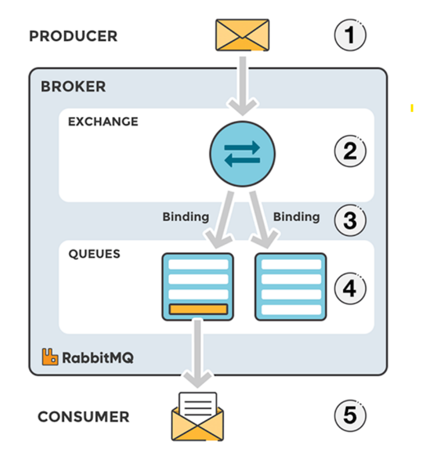

# AMQP

AMQP란 Advanced Message Queueing Protocol의 줄임말로 MQ의 오픈소스에 기반한 표준 프로토콜을 의미한다.

## AMQP의 기능

AMQP는 정확하게는 메세지 지향 미들웨어를 위한 개방형 표준 응용 계층(OSI 7계층의 7계층) 프로토콜을 말한다.

## RabbitMQ

RabbitMQ는 AMQP를 이용한 오픈소스 소프트웨어다.

### 동작 원리

1. Producer: 메세지를 생성하고 발송하는 주체로 메세지는 Queue에 저장된다. 중요한 점은 직접 Queue에 넣지 않고 Exchange를 통해 전달한다.
2. Exchange: Producer들에게서 전달받은 메세지들을 어떤 Queue들에게 발송할지를 결정하는 객체. 일종의 라우터 개념이다.
3. Queue: Producer들이 발송한 메세지들이 Consumer가 소비하기 전까지 보관되는 장소.
4. Binding: Exchange에게 메세지를 라우팅할 규칙을 지정하는 행위로 특정 조건에 맞는 메세지를 특정 큐에 전송하도록 설정할 수 있다.
