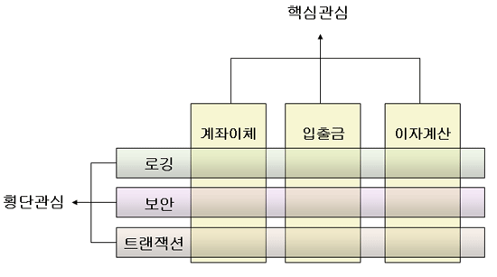

# AOP와 OOP

AOP와 OOP는 프로그래밍 기법들로 각각

OOP(Object Oriented Programming): 객체 지향 프로그래밍

AOP(Aspect Oriented Programming): 관점 지향 프로그래밍

을 의미한다.

## OOP

모든 데이터를 현실에 빗대어 객체로 다루는 프로그래밍 기법으로 5가지 특징을 가지고 있다.

### 캡슐화

클래스 내의 연관된 Property나 method를 하나의 캡슐로 묶어 외부로부터 클래스 접근을 최소화하는 것을 의미함.

#### 장점

- 외부로부터 클래스의 변수, 함수를 보호
- 외부에는 필요한 요소만 노출하고 내부 동작을 은닉함

#### 접근 제한자 (Java 기준)

클래스의 캡슐화는 public, default, private, protected와 같은 접근 제한자를 통해 구현이 가능하다.

public: 가장 넓은 범위를 커버하며, 어디에서든 접근이 가능한 제한 단위.

default: 따로 접근 제한자를 설정하지 않았을 경우에 적용되는 단위로, 정확하게 같은 패키지에 존재하는 클래스들에서만 접근이 가능하다.

private: 가장 좁은 범위로 제한하는 접근 제한자로 다른 클래스에서는 접근이 불가하며 설정된 클래스(자기 자신의 클래스)에서만 접근이 가능하다.

protected: 같은 패키지에 있는 클래스와 클래스를 상속한 하위 클래스에서 접근이 가능하다.

### 다형성

호출하는 객체에 따라 다른 동작을 한다는 원칙을 가지고 있으며 같은 이름의 메소드나 연산자가 여러 클래스에서 다른 방식으로 구현되는 성질을 의미한다.

가장 흔하게 사용되는 방식이 Overloading, Overriding 이다.

#### 오버로딩(Overloading)

다형성의 가장 대표적인 특징이라고 할 수 있으며 다음과 같은 특징이 있다.

- 같은 이름의 메소드를 여러번 사용이 가능하다.
- 다른 매개변수 목록 및 이름을 가진 같은 이름의 여러개의 메소드를 정의할 수 있다.
- Java에서는 오버로딩을 활용해 동일한 이름의 여러 메소드를 정의할 수 있다. 메소드 이름은 같지만 returnType이나 매게변수의 타입, 개수, 순서가 다른 경우 오버로딩으로 간주한다.

```
public class Calculator {
    public int add(int a, int b) {
        return a + b;
    }

    public double add(double a, double b) {
        return a + b;
    }

    public int add(int a, int b, int c) {
        return a + b + c;
    }

    public int add(int b, int c) {
        return b + c;
    }

    public int add(int ...a) {
        var result = 0;

        for (int num: a) {
            result += num;
        }

        return result;
    }
}
```

매개변수에 가변인자를 줌으로써 특정 갯수이면 특정 동작이 할 수 있게끔도 작업은 가능하나..
사람에 따라서는 헷갈릴 수 있으니 최대한 가변인자는 매개변수로 주지 않는 것이 좋을 듯 하다.

### 상속

대상을 객체로 추상화, 구현할 때 기존에 구현한 클래스를 재활용하여 구현할 수 있는 것을 의미함.

재활용해 공통화한 클래스를 부모 클래스, 기존 클래스를 재활용해 구현을 한 클래스는 자식 클래스가 된다.

- 대상을 추상화해 객체로 구현하거나, 대상의 특징을 일부분 구현한 객체가 있을 경우 이것을 확장해 대상을 추상화, 구현할 수 있다는 것을 말한다.
- 재정의 할 필요 없이 상속으로 해결 가능해 코드가 간결해짐.
- 자식 클래스에서 새로운 함수를 추가하거나 부모 클래스의 함수를 Override해서 사용 가능하다.
- 재사용성이 용이해진다.

## AOP

관점 지향 프로그래밍(Aspect Oriented Programming)이라고도 불리며 OOP를 더욱 발전시키기 위한 개념이다.

하나의 거대한 소프트웨어가 OOP 개념으로 만들어졌을 때 OOP의 관심사 외에 것들의 기능을 기능별로 모듈화해서 분리시키는 개념이라고도 한다.



위의 그림을 예제로 사용하자면 계좌이체, 입출금, 이자계산을 OOP 객체지향으로 설계했을 때, 로깅 기능, 보안 기능, 트랜잭션을 각각의 코드에 기능 구현이 되어있다.

각각의 OOP개념으로 설계된 기능에 공통적으로 로깅, 보안, 트랜잭션 기능을 가지고 있음이 보인다.

이 3가지 기능을 OOP코드에 심는 것이 아닌 외부로 빼내서 공통 모듈로 만드는 것이 AOP의 개념이라고 할 수 있다.

AOP의 핵심은 공통 모듈을 분리시켜 해당 소스코드가 외부의 다른 클래스에 존재하는 것이다.

### 장점

- 비지니스 로직마다 복붙 로직이 사라질 수 있다.
- 비지니스 로직을 개발하는 개발자는 자신의 개발하는 것에만 집중할 수 있고, 코드가 간결해지며, 유지보수가 쉬워진다.
- 재활용성이 높아진다.

### 구성요소

- JoinPoint: 로직을 삽입하는 시점 (함수가 실행 전, 후인지, 반환 후인지, 예외 발생 시, 실행 전과 후 인지)
- PointCut: 어떤 클래스의 어떤 함수에 삽입할 것인지에 대한 위치
- Aspect: JoinPoint + Pointcut
- Advice: 무엇을 삽입할 것인지
- Weaving: Aspect + Advice. 위빙을 통해 지정된 객체를 새 Proxy 객체로 생성하게 된다.
- Proxy: 비지니스 로직이 직접 실행되는 것이 아닌 Proxy(대리인)을 통해서 실행됨으로써 특정 시점에서 AOP 로직들이 돌 수 있게 처리한다.

## Spring AOP

Spring에서 AOP를 사용하는 방법, 원리 등에 대해 더 알아보자

### Proxy

위에 설명한 Proxy에서 조금 더 깊게 알아보자면

- target object와 Aspec를 하나로 합친 객체를 말하며 Weaving을 통해 생성된다.
- Proxy 객체는 2종류가 있다.
  - JDK Dynamic Proxy
    - Java Reflection을 이용하여 비교적 느림
    - 인터페이스를 구현한 객체를 대상으로 함
  - CGLIB Proxy
    - Spring boot에서 디폴트로 사용되는 객체
    - 상속을 통해 Proxy 구현
    - final class일 경우 Proxy로 생성 불가
    - 인터페이스를 통하지 않은 일반 객체를 대상으로 함

### Weaving

- Proxy 객체를 생성하는 과정을 말함
  - Compile-time Weaving: 컴파일 과정에서 Proxy 객체 생성
  - Load-Time Weaving: Load 시점에 AspectJ에 의해 Proxy 객체 생성
  - Runtime Weaving: Spring에서는 AspectJ를 사용하지 않고 Spring AOP를 사용해서 만듬. 실행속도가 AspectJ보다는 느리지만 구현하기 쉽고 소스코드나 클래스 정보 자체를 변경하지 않음

Spring AOP에서는 CGLIB Proxy를 사용하고 상속을 통해 Proxy를 구현한다.

final 클래스일 경우에는 Proxy로 생성이 불가능하고, private, final 메소드 또한 AOP 적용이 불가능하다.

해당 이슈로 인해 java의 record로 서비스를 만들고 Transactional을 걸게되면 에러가 발생해 사용이 불가능해진다.

#### 사용 불가에 대한 이유

AOP는 프록시 객체를 생성해 객체의 메소드 호출을 가로채는데,

private 메소드의 경우 해당 클래스 내에서만 접근이 가능하기에, 프록시 객체에서 호출되려 하니 에러가 발생하게된다.

final 클래스는 상속이 불가능하기 때문에 상속을 통해서 Proxy를 구현하는 스프링 AOP에서는 맞지 않는 방식이다.

final 메소드는 하위 클래스를 통해 오버라이딩이 불가능하기 때문에 AOP가 적용되지 않는다.
